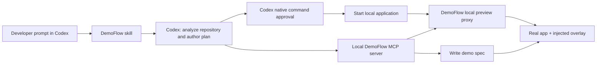

# DemoFlow for Codex — Product Requirements Document

## 1. Summary

**DemoFlow** is a local-first Codex plugin that turns a running web application into an explainable, live guided demo from a natural-language request.

A developer opens a repository in Codex and asks:

> Create a 45-second demo of a new user creating a workspace, adding a project, and inviting a teammate.

Codex reads the project and plans a safe user journey. DemoFlow starts the application behind a local preview proxy that injects a temporary guided-demo overlay into the real UI. The developer follows the live, explainable flow in their actual application without changing its source code.

The tool runs on the developer's machine. It has no DemoFlow account, hosted dashboard, payment flow, or source-code upload requirement.

## 2. Hackathon framing

**Track:** Developer Tools

**One-line pitch:** Turn any local codebase into a live, explainable product demo with one Codex prompt.

**Why Codex matters:** Normal demo software records a human clicking through an app. DemoFlow lets Codex understand the repository, infer the feature flow, create safe demo data, execute the journey, explain each interaction, and regenerate the asset when the product changes.

## 3. Problem

Product demos are expensive to keep current. Developers manually click through an application while recording a screen; product and sales teams then annotate screenshots or rebuild the flow in a demo platform. The resulting demo is often stale as soon as the UI changes.

For an unfamiliar repository, a teammate or reviewer also has to discover the key feature path before they can explain it. Existing interactive-demo products mainly record a manually chosen browser session or use captured screenshots; they do not use a local coding agent's understanding of source code and testable application behavior.

## 4. Target users

### Primary: developer shipping a feature

They want a quick artifact for a pull request, stakeholder review, or release announcement without manually scripting and editing a demo.

### Secondary: open-source maintainer or hackathon builder

They want judges or contributors to understand a working application rapidly.

### Future: sales engineer / product manager

They want a reusable walkthrough, but this release intentionally prioritizes the developer workflow.

## 5. Product goals

1. Produce a usable demo from one clear natural-language goal.
2. Execute against the real local application, not a fake screenshot-only prototype.
3. Propose a small, explainable choice of customer-facing demo starts, then generate an editable structured demo flow without modifying project source code.
4. Keep all project execution and artifacts local by default.
5. Make the Codex integration visibly essential, not decorative.
6. Be installable and testable by a hackathon judge in minutes.

## 6. Non-goals for MVP

- Hosted sharing, accounts, billing, team workspaces, or analytics.
- Supporting every frontend framework, authentication provider, or browser.
- Production deployment or testing against a customer's live environment.
- Autonomous handling of payments, real emails, destructive actions, or production secrets.
- Automated browser actions, video capture, AI voice generation, avatars, sophisticated video editing, or multi-language narration. These are post-MVP extensions.
- A generic replacement for a full QA platform.

## 7. Core user experience

### Happy path

1. User installs the DemoFlow Codex plugin and its local dependencies.
2. User opens a supported web-app repository in Codex.
3. User asks DemoFlow for a goal and target duration.
4. Codex examines the codebase and returns a proposed journey: personas, prerequisites, actions, expected outcomes, and any assumptions.
5. DemoFlow starts the app using a detected or user-approved development command.
6. DemoFlow serves the app through a local preview URL and injects its temporary overlay into the rendered HTML.
7. Before the first action, DemoFlow presents a brief product-facing introduction explaining what this demo will show.
8. The developer follows the real UI; each tooltip highlights a real element and advances after the expected interaction or UI state.
8. DemoFlow writes the editable demo specification to the repository and Codex flags any assumption or unresolved selector.

### Example prompt

```text
Use DemoFlow to create a 45-second demo for a first-time user.
Show: sign in, create a workspace, create a project, and invite a teammate.
Use only demo-safe data. Explain the value of each screen in plain English.
```

## 8. MVP scope

### Supported environment

- macOS first
- Node.js 20+
- Chromium or the developer's default browser
- React, Vite, or Next.js projects with an identifiable local development command
- One linear, authenticated or unauthenticated happy-path flow

### Required plugin behavior

- Provide a `Generate demo` skill for Codex.
- Ask for or infer: goal, target duration, and local start command.
- Keep the model plan structured and reviewable before actions run.
- Call the local MCP tools rather than relying on prose-only instructions.
- Return a validated app-start command to Codex; Codex executes it through its native command-approval UI so the developer can approve, deny, or explain an adjustment.
- When asked to demo the checked-out branch, compare local `HEAD` with a detected or developer-specified base branch, identify changed files, and let the developer choose a proposed journey or provide their own focus. This is read-only local Git analysis; it never fetches PRs, changes branches, or contacts GitHub.

### Required local runtime behavior

- Inspect and validate a local application start command without executing it.
- Derive candidate routes, buttons, links, labels, test IDs, and static accessible names from supported React/Next.js source roots before the app is running; rank likely user-facing starting controls while deprioritizing restore/reset/seed/debug UI, then use the live overlay only to verify the developer-chosen targets.
- Serve the app at a local proxy URL and inject the DemoFlow client overlay at runtime.
- Highlight elements using accessible selectors, labels, or existing test IDs.
- Present the walkthrough with a product-facing default theme, plus quiet and debug variants chosen in the saved demo spec.
- Present an optional, product-facing intro card before the first action, summarizing the release or journey for the audience.
- Advance based on user interaction or observable UI state.
- Treat filling a form and clicking its real submit button as one walkthrough action; advance only after the meaningful value and actual submit click.
- Wait briefly for the next step to mount after a real interaction before treating a React/Next.js conditional screen as a broken target.
- Write a portable `demo.spec.json` file.
- Save local branch and commit provenance in a branch-aware demo spec so a later viewer knows which change set it describes.
- Never stage, commit, or push Git changes while generating, repairing, or running a demo.
- Provide overlay controls to skip, restart, or edit tooltip text during the local session.
- Report selector and state-resolution failures back to Codex.

## 9. Output contract

All artifacts are written under `.demoflow/<demo-id>/` by default.

```text
.demoflow/onboarding-demo/
  demo.spec.json
  app-map.json
  run-report.json
```

### `demo.spec.json` shape

```json
{
  "title": "New user onboarding",
  "goal": "Show a user creating a workspace and inviting a teammate",
  "baseUrl": "http://127.0.0.1:3000",
  "intro": {
    "title": "What changed",
    "body": "This release makes project setup faster by keeping workspaces, projects, and invitations in one guided flow."
  },
  "steps": [
    {
      "id": "create-workspace",
      "action": "click",
      "selector": "getByRole('button', { name: 'Create workspace' })",
      "tooltip": {
        "title": "Create a shared workspace",
        "body": "Workspaces keep projects, members, and settings together for a team."
      },
      "expect": "Workspace creation dialog is visible",
      "advanceWhen": "Workspace creation dialog is visible"
    }
  ]
}
```

Selectors should be stored as a structured locator description where possible, rather than arbitrary executable text.

## 10. Architecture



### Components

| Component | Responsibility |
| --- | --- |
| Codex plugin | Installation manifest, skill instructions, and MCP registration |
| DemoFlow skill | Converts a user request into a constrained demo plan, requests Codex command approval, and hands off one preview URL |
| Local MCP server | Safe, typed operations for project inspection, start-command preparation, spec generation, and preview control; it never starts the target app |
| Local preview proxy | Proxies the dev server and injects the overlay without changing the project |
| Overlay client | Renders highlights/tooltips and observes user interactions in the real app |

### What reads the source code vs. the running app

DemoFlow uses two separate local inputs. This separation is central to the product:

| Input | Consumer | Why it is used |
| --- | --- | --- |
| Local repository files | Codex and the local project scanner | Understand routes, components, accessible labels, test IDs, data models, and intended user journeys |
| Running app at `localhost:<port>` | DemoFlow's local preview proxy | Render the real application and inject a temporary guided-demo overlay |

The proxy does not infer product intent from the page alone. It serves the live UI through a second local URL and loads the prebuilt overlay using the `demo.spec.json` that Codex generated from the local codebase. The overlay uses `pointer-events: none` except for its own Skip, Back, and Exit controls, so real application buttons and forms remain clickable. Stopping DemoFlow removes the overlay; no application source files, dependencies, or production assets are modified.

### MCP tool surface

| Tool | Purpose |
| --- | --- |
| `demoflow.inspect_project` | Return framework, scripts, routes, likely entry points, and existing E2E test hints |
| `demoflow.suggest_demo_starts` | Rank up to three likely customer-facing source controls for a stated demo outcome; it proposes choices but never writes a spec |
| `demoflow.list_demos` | List saved local demo specs without scanning project source |
| `demoflow.check_demo_freshness` | On-demand comparison of a saved demo fingerprint with the current compact app map |
| `demoflow.prepare_app_start` | Validate a declared package script and return its exact command, working directory, and likely local URL without executing it |
| `demoflow.create_preview` | Start a local reverse proxy that injects the DemoFlow overlay |
| `demoflow.write_spec` | Save the reviewed structured demo specification |
| `demoflow.open_preview` | Return the preview URL for the user to open in their browser |
| `demoflow.stop` | Stop the DemoFlow preview proxy and discard its temporary state |

The MCP server exposes no generic shell-command tool and never starts a target-app process. `prepare_app_start` only returns a command selected from declared project scripts. Codex executes that returned command in its normal terminal session, which surfaces the native approve / deny / explain approval prompt. Codex owns the resulting app process and can stop it through the same session.

A preview is a one-shot handoff. Once its local URL is returned, the developer uses it directly; Codex does not open the in-app browser to re-check the walkthrough or poll it for completion. A browser failure is saved as a structured local repair report and the overlay offers a copyable repair request. When the developer pastes that request or asks Codex to repair the demo, it reads the report and fixes the affected step; an MCP server cannot wake an already-completed Codex task automatically. DemoFlow only retries after the developer explicitly asks, preventing repeated restart and permission loops.

## 11. Demo planning and execution

Codex produces a JSON specification before the live preview opens. Each step has:

- user-facing intent
- action type and target description
- safe input values, if any
- expected observable result

Every step must identify one concrete element. DemoFlow prefers stable test IDs; when a repeated control has the same visible name, the spec also records the surrounding card title so the overlay can attach to the intended action. If the requested flow explicitly means the first repeated control and no stable card title exists, Codex records its one-based occurrence so that selection is visible and deterministic.
- tooltip title and explanation
- risk level

DemoFlow validates the specification before opening the preview:

- allow only actions in the supported set
- block remote URLs unless explicitly approved
- reject secret-like inputs and real payment actions
- require confirmation for sign-up, email, deletion, or external side effects unless a fixture mode is active
- retain a missing target or unmet advance condition as a structured local repair report (step, path, intended target, and reason) for Codex to read in the next explicit repair turn

## 12. Success criteria

### Product success

- A user can create a four-step guided demo in a supported sample app with one request.
- The live preview visibly runs over the real app progressing through all four steps.
- Every step highlights a real UI element and has a matching explanation.
- A user can edit tooltip copy and reload the preview without modifying application code.

### Hackathon demo success

The live demo should show, in under three minutes:

1. A real local repository opened in Codex.
2. A natural-language DemoFlow request.
3. Codex inspecting the project and forming a plan.
4. The generated preview opening the actual app with a live overlay.
5. The developer clicking through the real end-to-end flow with explanations.
6. One deliberate UI change, followed by regeneration or a clear missing-target report.

## 13. Acceptance criteria

- Plugin installs into Codex with documented steps.
- Judge can run the included sample project and invoke DemoFlow without a hosted DemoFlow account.
- Codex displays its native command approval before a target-app development script starts.
- `prepare_app_start` returns only a declared package script and a bounded local URL hint.
- The preview loads the actual app through the local proxy with an overlay visible.
- The source tree remains unchanged before and after creating a demo, except for `.demoflow/` artifacts.
- A missing target or unmet UI state results in a structured error report and no claim of a successful demo.
- DemoFlow does not write outside the repository's `.demoflow/` directory except temporary runtime files.

## 14. Risks and mitigations

| Risk | Mitigation |
| --- | --- |
| Codex selects an incorrect flow | Require a structured plan, assertions after every step, and transparent failure reports |
| Apps need complex authentication or data | Ship a fixture-friendly sample app; support a user-provided demo login or seeded mode later |
| Browser selectors are brittle | Prefer accessibility roles, labels, and test IDs; return UI evidence for Codex to repair the spec |
| Unsafe mutations | Default to local URLs and isolated test data; block high-risk actions |
| Scope grows too large | Ship linear live-overlay flows before automation, recording, or branching |

## 15. Milestones

### Milestone 1 — Foundation

- Plugin manifest and `Generate demo` skill
- TypeScript local MCP server scaffold
- Sample Vite/React application with a four-step onboarding flow
- `inspect_project`, `prepare_app_start`, and preview cleanup

### Milestone 2 — Real demo generation

- Local reverse proxy and overlay injection
- Overlay target resolution, step progression, and run report
- Codex spec-generation prompt and repair loop

### Milestone 3 — Presentable artifact

- `demo.spec.json` writer
- Overlay controls with next/back, restart, and editable tooltip text
- README, install path, troubleshooting, and example prompt

### Milestone 4 — Submission polish

- Record the under-three-minute YouTube demo with audio
- Add screenshot/GIF to README
- Document Codex usage and preserve dated commits/session evidence

## 16. Open decisions

1. **Plugin packaging:** bundle the MCP server inside the plugin or require a separate `npx` install. Recommendation: bundle it for the hackathon, with a single documented install path.
2. **Initial authentication strategy:** use a known demo login and seeded data in the sample project; defer generic auth discovery.
3. **Overlay injection:** begin with a local reverse proxy; consider a browser-extension or development-only script adapter only if framework/CSP constraints demand it.
4. **Automation and video:** add Playwright auto-run and WebM capture only after the manual live overlay is reliable.
5. **Framework support:** advertise React/Vite/Next.js only after the sample path works end to end.

## 17. Submission checklist

- [ ] Public repository with a license, README, and sample project
- [ ] Plugin installation instructions and supported platform statement
- [ ] One-command judge test path and local preview URL
- [ ] Public YouTube video under three minutes with audio
- [ ] Explanation of how Codex and GPT-5.6 were used
- [ ] Primary Codex `/feedback` session ID
- [ ] Chosen track: Developer Tools
