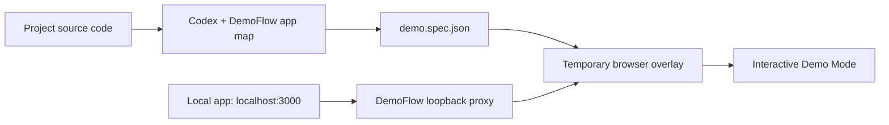

# DemoFlow for Codex

Turn a local web application into a live, explainable guided demo with a Codex prompt.

DemoFlow reads a local project to create a versioned `demo.spec.json`, then serves the running app through a loopback-only proxy that injects a temporary walkthrough overlay. The original app remains interactive and its source code is not changed.

## Status

Build Week MVP. DemoFlow includes a packaged local MCP runtime, a loopback-only proxy, a live browser overlay, and a Vite/React sample application.

## For users

DemoFlow is intended to be installed through Codex as a plugin. Once published, the user flow is:

1. Install **DemoFlow** in Codex.
2. Open a local web-app project.
3. Ask: “Create a guided demo for onboarding.”
4. Confirm the project development script.
5. Open the generated local **Demo Mode** URL and click through the real app.

There is no DemoFlow account, SaaS dashboard, source upload, or per-demo payment. The plugin bundles its MCP runtime; users should not need `pnpm install`.

The macOS Codex Desktop build launches the bundled MCP runtime with the Node.js runtime shipped inside ChatGPT, so users do not need a separate Node or package-manager installation. Codex marketplace publication is still pending; until then, the plugin is installed from its released plugin bundle.

## Install and test locally

The repository now includes a local Codex marketplace manifest at `.agents/plugins/marketplace.json`.

```bash
codex plugin marketplace add /absolute/path/to/demoflow
codex plugin add demoflow@personal
```

Restart Codex or start a new Codex task in a supported project after installing. For the included sample app, use the following prompt:

```text
Use DemoFlow to inspect this project and create the onboarding guided demo.
Use the dev package script and the existing .demoflow/onboarding/demo.spec.json fixture.
```

DemoFlow will ask for approval before starting the project `dev` script. It should return a local Demo Mode URL; open that URL and click through the real onboarding flow. On macOS Codex Desktop, the plugin uses ChatGPT's bundled Node.js runtime, so no DemoFlow package-manager install is required.

### Contributor checks

```bash
cd plugins/demoflow/mcp-server
pnpm test
pnpm package-plugin

cd ../sample-app
pnpm build
```

## For contributors

Repository cloning and `pnpm install` are contributor-only steps. They are used to change or verify DemoFlow itself, not to use a released plugin.

```text
plugins/demoflow/mcp-server     # MCP source and tests
plugins/demoflow/overlay        # Browser overlay injected by the local proxy
plugins/demoflow/runtime        # Committed bundled runtime included in a plugin release
plugins/demoflow/sample-app     # Local verification app
```

## Documents

- [Product requirements](PRD.md)
- [Technical specification](SPEC.md)
- [Build checklist](CHECKLIST.md)
- [Build Week video script](DEMO_SCRIPT.md)

## Intended experience

1. Open a supported app repository in Codex.
2. Ask DemoFlow for a short user journey.
3. Approve the generated `demo.spec.json` and local development script.
4. Open Demo Mode at a second localhost URL.
5. Click through the real application while tooltips explain each feature.

## How it works



The proxy only serves the app through a second loopback URL and injects the overlay at runtime. It does not alter application source files. The transparent highlight ignores pointer events, so the user continues clicking the real UI.

## Build Week / judge path

1. Install the DemoFlow plugin bundle in Codex.
2. Open `plugins/demoflow/sample-app` or another supported local React/Vite project.
3. Ask Codex to use the DemoFlow skill to create an onboarding flow.
4. Approve the project `dev` script.
5. Open the returned Demo Mode URL and complete the real four-step onboarding flow.

Codex was used to define the product flow, generate the structured demo specification, and operate the local MCP tools. The project keeps the model-facing context compact by using a deterministic app map rather than repeated browser screenshots or DOM dumps.

## Local verification

The current first target is macOS + Node.js 20+ + a Vite/React sample app. The MCP server source is at `plugins/demoflow/mcp-server`.

No application source files are changed to enable Demo Mode. Generated specs are intended to live in `.demoflow/`, which is ignored by Git by default.
