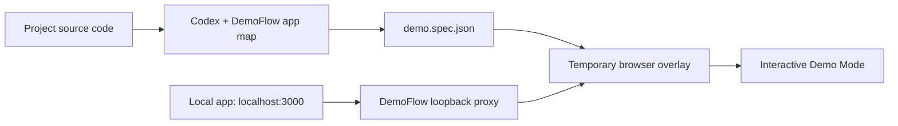

# DemoFlow for Codex

Turn a local web application into a live, explainable guided demo with a Codex prompt.

DemoFlow reads a local project to create a versioned `demo.spec.json`, then serves the running app through a loopback-only proxy that injects a temporary walkthrough overlay. The original app remains interactive and its source code is not changed.

## Status

Build Week MVP. DemoFlow includes a packaged local MCP runtime, a loopback-only proxy, a live browser overlay, and a Vite/React sample application.

## Install and use

### Prerequisites

- Codex with plugin support.
- Node.js 20+ available as `node` in the environment that starts Codex.
- A local web app that can already run on the developer's machine. DemoFlow does not install the app's dependencies for it.

### Install from GitHub

Run these commands once. They download and install the plugin; do **not** clone this repository or run `pnpm install` to use DemoFlow.

```bash
codex plugin marketplace add blacktomang/demoflow --ref main
codex plugin add demoflow@personal
```

Start a new Codex task after installation so its DemoFlow skill and MCP tools are available.

### Create a guided demo

1. Open the local web-app project in Codex.
2. Ask, for example: `Use DemoFlow to create a guided onboarding demo for this app.`
3. Review the generated editable flow at `.demoflow/<demo-id>/demo.spec.json`.
4. Approve Codex's native command prompt for the project's existing development script, or cancel/explain an adjustment there.
5. Open the returned **Demo Mode** localhost URL and click through the real application. The tooltips advance as the real app changes state.
6. Ask Codex to stop DemoFlow when you are finished.

DemoFlow never uploads project source code to a DemoFlow service, does not require an account or payment, and does not permanently modify application source. It writes only local `.demoflow/` artifacts and injects the temporary overlay through a second loopback-only localhost URL.

### Saved demos and freshness

Each saved demo contains an editable `demo.spec.json` and a small, shareable `app-map.json` snapshot. The snapshot contains framework hints, scripts, routes, test IDs, labels, and a SHA-256 fingerprint—never raw source files, local paths, form data, or credentials.

Running a saved demo uses its existing spec and does not re-inspect the project. When a developer asks to validate freshness, DemoFlow rebuilds the compact map locally and compares fingerprints. A mismatch means the demo may be stale; it does not prove that the demo is broken. Saved `.demoflow/` folders remain ignored by Git by default, but a team can intentionally commit selected demo folders to share them.

DemoFlow runs its bundled runtime with the developer's own Node.js 20+ installation. It detects a missing or outdated Node.js version and prints a clear fix; it never depends on an internal ChatGPT/Codex Node runtime.

## Install and test from a local checkout

The repository now includes a local Codex marketplace manifest at `.agents/plugins/marketplace.json`.

```bash
codex plugin marketplace add /absolute/path/to/demoflow
codex plugin add demoflow@personal
```

Restart Codex or start a new Codex task in a supported project after installing. For the included sample app, use the following prompt:

```text
Use DemoFlow to inspect this project and create the onboarding guided demo.
Use the dev package script and the existing .demoflow/onboarding/demo.spec.json fixture.
```

DemoFlow will ask for approval before starting the project `dev` script. It should return a local Demo Mode URL; open that URL and click through the real onboarding flow. Node.js 20+ must be available as `node` in the environment that starts Codex; no DemoFlow package-manager install is required.

### Contributor checks

```bash
cd plugins/demoflow/mcp-server
pnpm test
pnpm package-plugin

cd ../sample-app
pnpm build
```

## For contributors

Repository cloning and `pnpm install` are contributor-only steps. They are used to change or verify DemoFlow itself, not to use a released plugin.

```text
plugins/demoflow/mcp-server     # MCP source and tests
plugins/demoflow/overlay        # Browser overlay injected by the local proxy
plugins/demoflow/runtime        # Committed bundled runtime included in a plugin release
plugins/demoflow/sample-app     # Local verification app
```

## Documents

- [Product requirements](PRD.md)
- [Technical specification](SPEC.md)
- [Build checklist](CHECKLIST.md)
- [Build Week video script](DEMO_SCRIPT.md)

## Intended experience

1. Open a supported app repository in Codex.
2. Ask DemoFlow for a short user journey.
3. Approve Codex's native command prompt for the local development script.
4. Open Demo Mode at a second localhost URL.
5. Click through the real application while tooltips explain each feature.

## How it works



The proxy only serves the app through a second loopback URL and injects the overlay at runtime. It does not alter application source files. The transparent highlight ignores pointer events, so the user continues clicking the real UI.

## Build Week / judge path

1. Install the DemoFlow plugin bundle in Codex.
2. Open `plugins/demoflow/sample-app` or another supported local React/Vite project.
3. Ask Codex to use the DemoFlow skill to create an onboarding flow.
4. Approve the project `dev` script.
5. Open the returned Demo Mode URL and complete the real four-step onboarding flow.

Codex was used to define the product flow, generate the structured demo specification, and operate the local MCP tools. The project keeps the model-facing context compact by using a deterministic app map rather than repeated browser screenshots or DOM dumps.

## Local verification

The current first target is macOS + Node.js 20+ + a Vite/React sample app. The MCP server source is at `plugins/demoflow/mcp-server`.

No application source files are changed to enable Demo Mode. Generated specs are intended to live in `.demoflow/`, which is ignored by Git by default.
